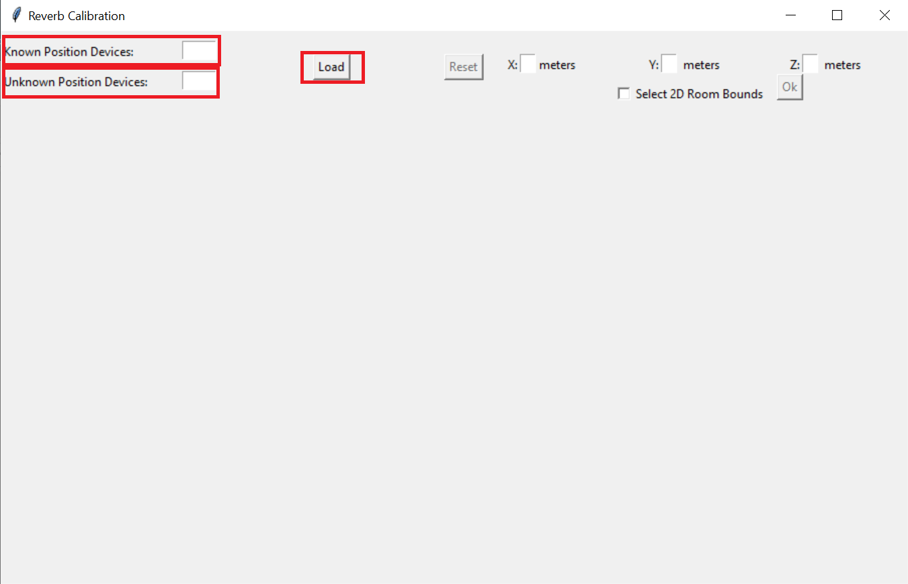

# A FRAMEWORK FOR ACOUSTIC DEVICES POSITION CALIBRATION
This work proposes the development of an acoustic measurement calibration framework, in which the unknown position of the devices is estimated by an optimization problem using the acoustic information given by the room impulse response, taken and not taken into account the delay introduced by the devices in the processing chain. 

In this document the user can find the documentation of the code implemented in this project. 

## Documentation of the code
The code of this project consists of series of functions implementing the calibration algorithm and a series of functions implementing a GUI for the easier use of the algorithm. Therefore, we can divide the documentation in three sections: Libraries used, Calibration algorithm functions and GUI functions 

### Libraries used

In order to implement this application the next libraries have been used in the code:
**matplotlib** : Library for plotting results. 
**numpy** : Library to facilitate the management of the data.
**pandas** : Library to facilitate the management of the data.
**scipy** : Library to implement different functions like *minimization*, *findpeaks*, among others.
**tkinter** : Library to design the GUI.

### Calibration algorithm functions

These are the functions used to implement the theoretical part of the algorithm itself.
- **find_directPath(this_rir, top_peaks = 15)** : This function takes as input a signal (room impulse response in this project) and the number of peaks desired to search in and gives as an output the sample in which the first peak of the RIR, and therefore the direct path, is. It computes first the absolute value of *this_rir* because sometimes in the RIR the first peak (direct path) is negative.

- **compute_distance(audio,fs,c,interp_factor = 2, do_interpolation = True)** : This function takes as an input a room impulse response, the sample frequency, the sound velocity, the interpolation factor and the option of doing interpolation or not, and it gives as an output the distance in meters between the microphone and source correspondent to the RIR used as input. It basically compute the distance using the *find_directPath* function explained before and applying interpolation if the user wants it. From the *find_directPath* function it obtains the sample in which the first peak is and after that dividing by the sample frequency it obtains the time-of-arrival (TOA) and then it is multiply by the sound velocity to get the distance. The audio used as an input can be a matrix of (RIRlength x #KnownPositionDevices), giving back a vector of (1 x #KnownPositionDevices) with the distances between each device and the unknown device.

- **calibration2D_nodel(audio,fs,PosKnown,c,bnds,nUnknown)** : This function take as an input the data correspondent to the room impulse responses, the sample frequency, the known positions of the devices, the sound velocity, the bounds that contraints the search in the minimization problem and the number of the devices with unknown positions. It gives as an output the estimated positions (2-dimensions, (*x*,*y*)) for the devices with unknown position. Inside this function it can be found another function that it is the loss function to minimize (a theoretical explanation of this function is explained in the report of this project).

- **calibration2D_del(audio,fs,PosKnown,c,bnds,nUnknown)** : This functions does the same as the previous one but it estimates the possible delay introduced in the processing chain. As the one before this functions works for 2-dimensions. 

- **calibration3D_nodel(audio,fs,PosKnown,c,bnds,nUnknown)** :This function works exactly the same as *calibration2D_nodel* but the output gives the estimated positions in 3-dimension (*x*,*y*,*z*). 

- **calibration2D_del(audio,fs,PosKnown,c,bnds,nUnknown)** : This function works exactly the same as *calibration2D_del* but the output gives the estimated positions in 3-dimension (*x*,*y*,*z*). 

### GUI functions

These are the functions used to implement the GUI and its functionalities.
- **load()** : This function is the one that initializes all the needed variables and enable the rest of the buttons and inputs in of the GUI. It is called when the user presses the button *Load* in the GUI.

- **open_file(i)** : This functions is the one that allows the user to input the RIR's in the algorithm. As an input it takes the number of the device to which corresponds the RIR in order to keep the order of them. It also calls the next function *load_rir*. It is called when the button *open* next to *# Device RIR* in the GUI is pressed.

- **load_rid(rir,n)** : This function takes as an input the RIR and the number of device. It loads the main matrix *data* (initialized in *load*) with the RIR in the correspondent position according to the number of device. If you see the code of this function it can be seen that when it loads the RIR into the main matrix, it does it with a certain length (*RIRlen*); this is because the information required of the RIR is in these first samples and taking a bigger number of samples would increase the computation time. 

- **open_file2()** : This functions does the same as *open_file* but it loads the matrix of the known positions. It is called when the user presses the button *open* next to *Known Devices File*. 

- **dimension()** : This function is the one that manages the number of dimensions to take into account in the algorithm. It creates a checkbox *Select 2D Room Bounds* that if its checked eliminate the *z* coordinate. 

- **reset()** : This function resets the GUI to the beginning to compute again the estimated positions 

- **set_bounds()** : This functions loads the matrix bounds depending if we are in a 2D or 3D case. The bounds for this algorithm are the size of the room and a 0.5 to the delay.

- **calculate()** : This is the main function. It computes the estimated position of the devices using the rest of the calibration algorithm functions and taking into account the rest of variables like if the user wants to estimate the delay, or if the user wants 2 or 3 dimensions.

A better explanation and a better understanding can be obtained if the user checks the code and the comments all along the code.

## GUI guide

To use the GUI it is recommended to follow the next steps:

- First, introduce the number of '*Known position devices*' and '*Unknown position devices*' (a number), and press the button *Load*

- After that the user will find an GUI like this:

